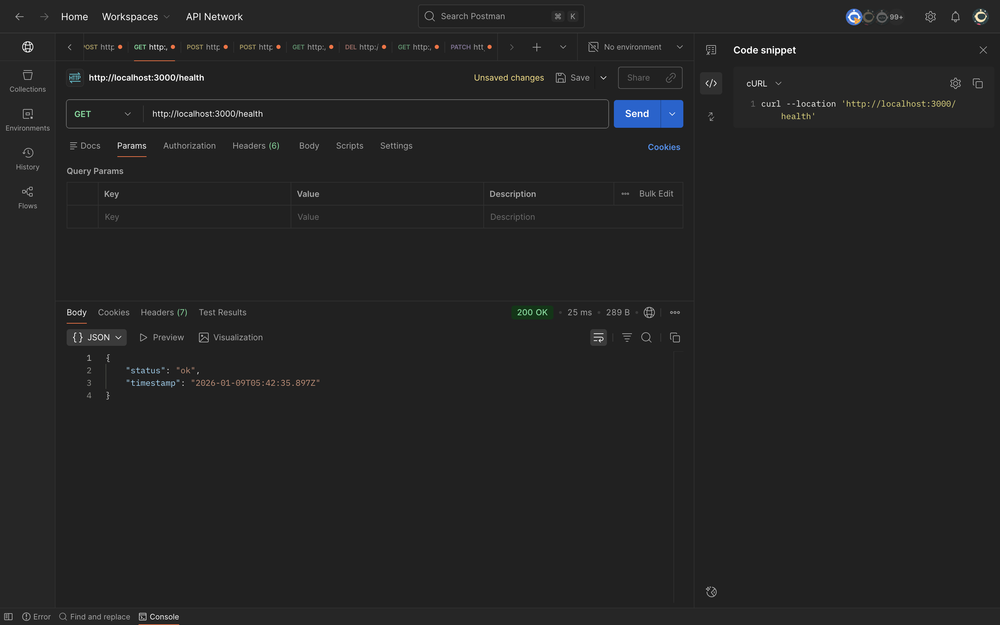
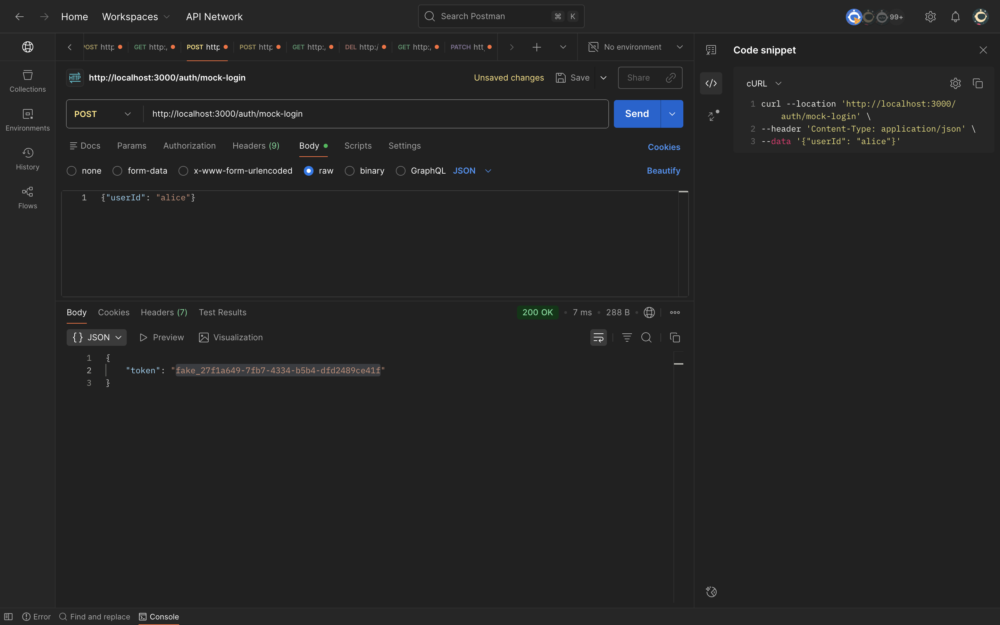
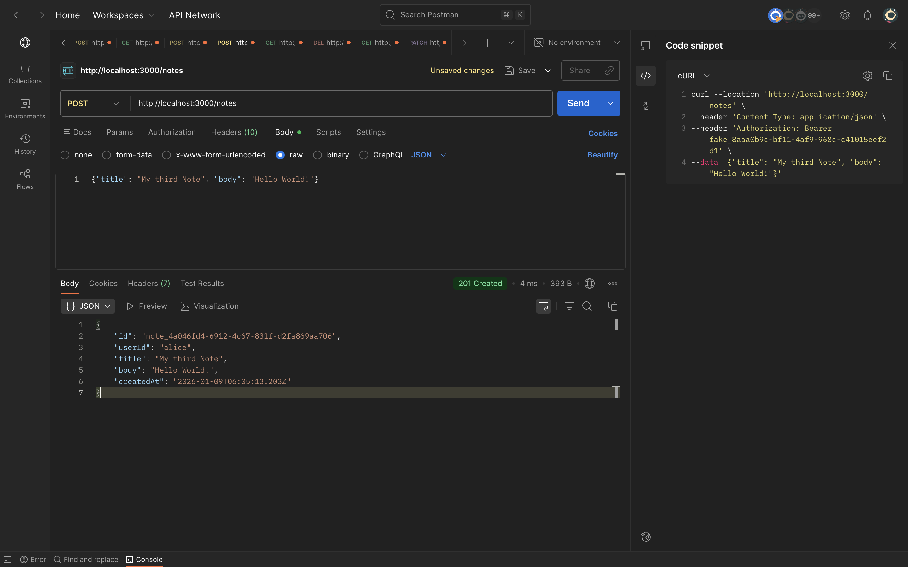
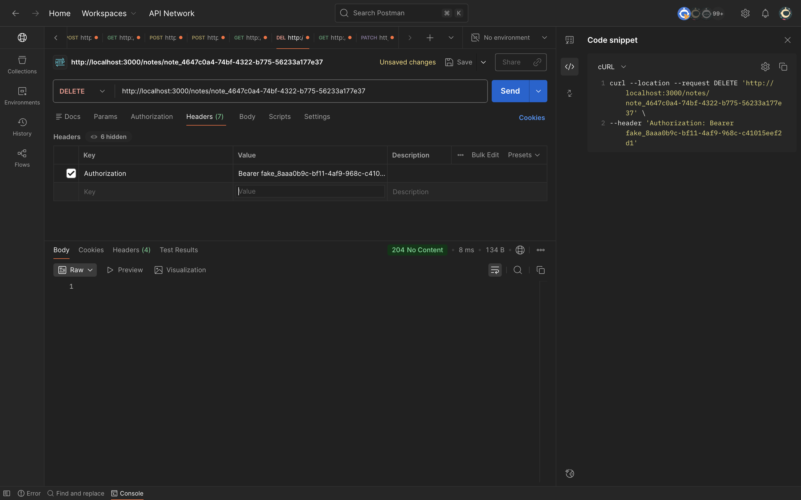
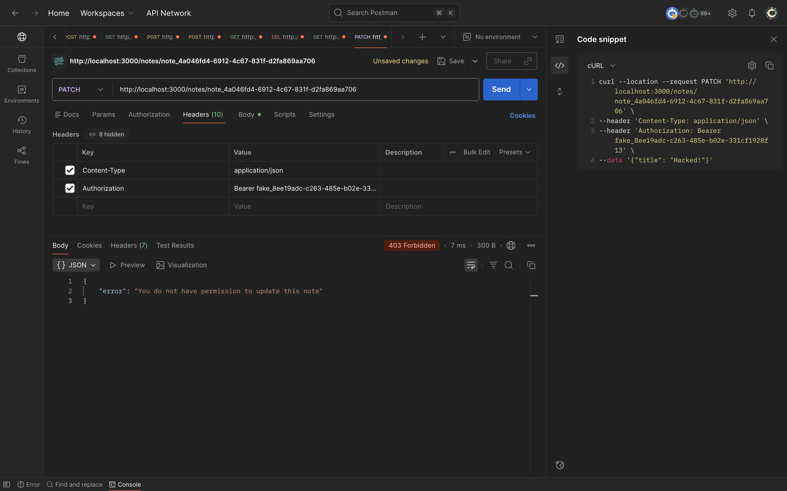
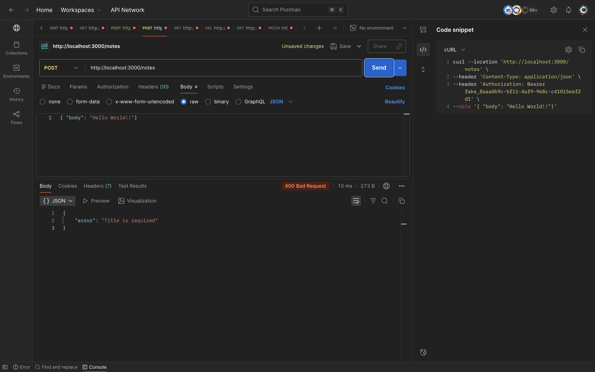

# Quick Notes API

A lightweight, in-memory REST API for managing personal notes with authentication and authorization.

## Features

- **Mock Authentication**: Simple token-based auth supporting multiple users
- **CRUD Operations**: Create, read, update, and delete notes
- **Authorization**: Users can only access their own notes
- **Validation**: Input validation with meaningful error messages
- **Logging**: Request/response logging with timing
- **Health Check**: Monitor API status

## Project Overview

All required endpoints implemented:
- POST /auth/mock-login - Fake token generation for multiple users
- POST /notes - Create with validation (title required, max 80 chars, body optional max 500 chars)
- GET /notes - List user's notes (newest first)
- PATCH /notes/:id - Partial update with validation
- DELETE /notes/:id - Delete with ownership check
- GET /health - Health check endpoint (extra feature)

Authentication & Authorization:
- Missing/invalid token returns 401
- Valid token but accessing another user's note returns 403
- Bearer token format required
- Multiple users supported simultaneously

## Tech Stack

- **Runtime**: Node.js with TypeScript
- **Framework**: Express.js
- **Storage**: In-memory (Map-based)
- **ID Generation**: UUID v4

## Architecture

**Layered Structure:**

1. **Routes Layer** - Handles HTTP request/response, delegates to services
2. **Middleware Layer** - Authentication (Bearer tokens) and logging
3. **Services Layer** - Business logic, validation, CRUD operations
4. **Storage Layer** - In-memory Map-based storage (easy to swap with database)
5. **Types** - Centralized TypeScript interfaces and DTOs

**Key Design Decisions:**
- Fake tokens with `fake_` prefix + UUID for authentication
- All note operations check ownership for authorization
- Validation in service layer for reusability
- Consistent JSON error responses with appropriate HTTP status codes
- Full TypeScript coverage with no `any` types

## Screenshots

### Health Check Endpoint
Health check returns API status and timestamp.



### User Login and Token Generation
Alice logs in and receives a fake authentication token for API access.



### Create Notes
Alice creates a new note with title and body using her authentication token.



### List User Notes
Alice retrieves all her notes sorted by creation time (newest first).


### Delete Own Notes (204 Success)
Alice successfully deletes her own note and receives HTTP 204 No Content response.



### Authorization Check (403 Forbidden)
Bob attempts to delete Alice's note and receives HTTP 403 Forbidden error demonstrating proper authorization.



### Invalid Token Error (401 Unauthorized)
Request with invalid or expired token is rejected with HTTP 401 Unauthorized error.


### Validation Error (400 Bad Request)
Creating a note with empty title fails validation and returns HTTP 400 with error message.



## Project Structure

```
QuickNotes/
├── src/
│   ├── middleware/
│   │   ├── auth.ts          # Authentication middleware
│   │   └── logger.ts        # Request logging middleware
│   ├── routes/
│   │   ├── auth.ts          # Auth endpoints
│   │   ├── notes.ts         # Notes CRUD endpoints
│   │   └── health.ts        # Health check endpoint
│   ├── services/
│   │   ├── authService.ts   # Auth business logic
│   │   └── notesService.ts  # Notes business logic & validation
│   ├── storage.ts           # In-memory data storage
│   ├── types.ts             # TypeScript interfaces
│   └── server.ts            # Express app setup
├── package.json
├── tsconfig.json
└── README.md
```

### What's Included

**Core Files:**
- **`src/server.ts`** - Express app setup and configuration
- **`src/storage.ts`** - In-memory data storage (Map-based)
- **`src/types.ts`** - TypeScript interfaces and DTOs

**Services:**
- **`src/services/authService.ts`** - Token generation & validation
- **`src/services/notesService.ts`** - Business logic with validation

**Middleware:**
- **`src/middleware/auth.ts`** - Bearer token authentication
- **`src/middleware/logger.ts`** - Request/response logging

**Routes:**
- **`src/routes/auth.ts`** - POST /auth/mock-login
- **`src/routes/notes.ts`** - CRUD endpoints for notes
- **`src/routes/health.ts`** - GET /health

## Getting Started

### Prerequisites

- Node.js (v16 or higher)
- npm or yarn

### Installation

1. Install dependencies:
```bash
npm install
```

2. Start the development server:
```bash
npm run dev
```

The API will be running at `http://localhost:3000`

### Production Build

```bash
npm run build
npm start
```

## API Endpoints

### 1. Health Check

Check if the API is running.

**Request:**
```bash
curl http://localhost:3000/health
```

**Response: 200 OK**
```json
{
  "status": "ok",
  "timestamp": "2026-01-09T10:00:00.000Z"
}
```

---

### 2. Mock Login

Get an authentication token for a user.

**Request:**
```bash
curl -X POST http://localhost:3000/auth/mock-login \
  -H "Content-Type: application/json" \
  -d '{"userId": "alice"}'
```

**Response: 200 OK**
```json
{
  "token": "fake_a1b2c3d4-e5f6-7890-abcd-ef1234567890"
}
```

**Validation:**
- `userId` is required and must be a non-empty string

---

### 3. Create Note

Create a new note (requires authentication).

**Request:**
```bash
curl -X POST http://localhost:3000/notes \
  -H "Content-Type: application/json" \
  -H "Authorization: Bearer YOUR_TOKEN_HERE" \
  -d '{
    "title": "Shopping list",
    "body": "Milk, eggs, bread"
  }'
```

**Response: 201 Created**
```json
{
  "id": "note_a1b2c3d4-e5f6-7890-abcd-ef1234567890",
  "userId": "alice",
  "title": "Shopping list",
  "body": "Milk, eggs, bread",
  "createdAt": "2026-01-09T10:00:00.000Z"
}
```

**Validation:**
- `title`: required, non-empty after trim, max 80 characters
- `body`: optional, max 500 characters

**Error Examples:**
```bash
# Missing title
{"error": "Title is required"}

# Title too long
{"error": "Title must not exceed 80 characters"}

# Body too long
{"error": "Body must not exceed 500 characters"}
```

---

### 4. List Notes

Get all notes for the authenticated user (newest first).

**Request:**
```bash
curl http://localhost:3000/notes \
  -H "Authorization: Bearer YOUR_TOKEN_HERE"
```

**Response: 200 OK**
```json
[
  {
    "id": "note_xyz789",
    "userId": "alice",
    "title": "Shopping list",
    "body": "Milk, eggs, bread",
    "createdAt": "2026-01-09T10:05:00.000Z"
  },
  {
    "id": "note_abc123",
    "userId": "alice",
    "title": "Meeting notes",
    "body": "Discuss Q1 goals",
    "createdAt": "2026-01-09T10:00:00.000Z"
  }
]
```

---

### 5. Update Note

Partially update a note (requires authentication and ownership).

**Request:**
```bash
curl -X PATCH http://localhost:3000/notes/note_abc123 \
  -H "Content-Type: application/json" \
  -H "Authorization: Bearer YOUR_TOKEN_HERE" \
  -d '{
    "title": "Updated Meeting Notes",
    "body": "Discuss Q1 goals and budget"
  }'
```

**Response: 200 OK**
```json
{
  "id": "note_abc123",
  "userId": "alice",
  "title": "Updated Meeting Notes",
  "body": "Discuss Q1 goals and budget",
  "createdAt": "2026-01-09T10:00:00.000Z",
  "updatedAt": "2026-01-09T10:30:00.000Z"
}
```

**Validation:**
- At least one field (`title` or `body`) must be provided
- Same validation rules as create

**Error Examples:**
```bash
# No fields provided
{"error": "No updatable fields provided"}

# Note not found
{"error": "Note not found"}

# Not the owner
{"error": "You do not have permission to update this note"}
```

---

### 6. Delete Note

Delete a note (requires authentication and ownership).

**Request:**
```bash
curl -X DELETE http://localhost:3000/notes/note_abc123 \
  -H "Authorization: Bearer YOUR_TOKEN_HERE"
```

**Response: 204 No Content**
(Empty response body)

**Error Examples:**
```bash
# Note not found - 404
{"error": "Note not found"}

# Not the owner - 403
{"error": "You do not have permission to delete this note"}
```

---

## Authentication & Authorization

All note endpoints require authentication via Bearer token:

```
Authorization: Bearer <token>
```

**HTTP Status Codes:**
- `401 Unauthorized`: Missing or invalid token
- `403 Forbidden`: Valid token but trying to access another user's note
- `404 Not Found`: Note doesn't exist

## Testing Multiple Users

```bash
# User 1: Alice
curl -X POST http://localhost:3000/auth/mock-login \
  -H "Content-Type: application/json" \
  -d '{"userId": "alice"}'
# Save alice's token

# User 2: Bob
curl -X POST http://localhost:3000/auth/mock-login \
  -H "Content-Type: application/json" \
  -d '{"userId": "bob"}'
# Save bob's token

# Alice creates a note
curl -X POST http://localhost:3000/notes \
  -H "Content-Type: application/json" \
  -H "Authorization: Bearer ALICE_TOKEN" \
  -d '{"title": "Alice note", "body": "Private"}'

# Bob tries to access Alice's note (will get 403)
curl -X PATCH http://localhost:3000/notes/ALICE_NOTE_ID \
  -H "Content-Type: application/json" \
  -H "Authorization: Bearer BOB_TOKEN" \
  -d '{"title": "Hacked"}'
```

## Complete Workflow Example

```bash
# 1. Health check
curl http://localhost:3000/health

# 2. Login and save token
TOKEN=$(curl -s -X POST http://localhost:3000/auth/mock-login \
  -H "Content-Type: application/json" \
  -d '{"userId": "alice"}' | jq -r '.token')

echo "Token: $TOKEN"

# 3. Create a note and save ID
NOTE_ID=$(curl -s -X POST http://localhost:3000/notes \
  -H "Content-Type: application/json" \
  -H "Authorization: Bearer $TOKEN" \
  -d '{"title": "Shopping List", "body": "Milk, eggs, bread"}' | jq -r '.id')

echo "Note ID: $NOTE_ID"

# 4. Create another note
curl -X POST http://localhost:3000/notes \
  -H "Content-Type: application/json" \
  -H "Authorization: Bearer $TOKEN" \
  -d '{"title": "Todo", "body": "Finish project"}'

# 5. List all notes (should see 2, newest first)
curl -s http://localhost:3000/notes \
  -H "Authorization: Bearer $TOKEN" | jq .

# 6. Update the first note
curl -s -X PATCH http://localhost:3000/notes/$NOTE_ID \
  -H "Content-Type: application/json" \
  -H "Authorization: Bearer $TOKEN" \
  -d '{"title": "Updated List", "body": "Milk, eggs, bread, butter"}' | jq .

# 7. Delete the note
curl -X DELETE http://localhost:3000/notes/$NOTE_ID \
  -H "Authorization: Bearer $TOKEN"

# 8. Verify deletion (should see only 1 note)
curl -s http://localhost:3000/notes \
  -H "Authorization: Bearer $TOKEN" | jq .
```

## Testing Error Cases

### 401 - Unauthorized (Missing Token)
```bash
curl -s -X POST http://localhost:3000/notes \
  -H "Content-Type: application/json" \
  -d '{"title": "Test", "body": "Should fail"}' | jq .
```

### 401 - Unauthorized (Invalid Token)
```bash
curl -s -X POST http://localhost:3000/notes \
  -H "Content-Type: application/json" \
  -H "Authorization: Bearer invalid_token_123" \
  -d '{"title": "Test"}' | jq .
```

### 400 - Validation Error (Empty Title)
```bash
curl -s -X POST http://localhost:3000/notes \
  -H "Authorization: Bearer $TOKEN" \
  -d '{"title": "   ", "body": "Empty title"}' | jq .
```

### 400 - Validation Error (Title Too Long)
```bash
curl -s -X POST http://localhost:3000/notes \
  -H "Authorization: Bearer $TOKEN" \
  -d '{"title": "123456789012345678901234567890123456789012345678901234567890123456789012345678901234567890"}' | jq .
```

### 404 - Note Not Found
```bash
curl -s -X DELETE http://localhost:3000/notes/note_does_not_exist \
  -H "Authorization: Bearer $TOKEN" | jq .
```

## Extra Feature: Logging

All requests are logged with:
- ISO 8601 timestamp
- HTTP method
- Path
- Status code
- Response time in milliseconds

Example output:
```
[2026-01-09T10:00:00.000Z] POST /auth/mock-login 200 - 5ms
[2026-01-09T10:00:05.000Z] POST /notes 201 - 3ms
[2026-01-09T10:00:10.000Z] GET /notes 200 - 2ms
[2026-01-09T10:00:15.000Z] PATCH /notes/note_abc123 200 - 4ms
[2026-01-09T10:00:20.000Z] DELETE /notes/note_abc123 204 - 2ms
```

## Verification Checklist

All requirements tested and verified:

- Health check endpoint returns status
- Mock authentication with multiple users
- Create notes with validation (title required, max 80 chars; body optional, max 500 chars)
- List user's notes sorted newest first
- Update notes with partial updates
- Delete notes
- 401 for missing/invalid tokens
- 403 for unauthorized access to other users' notes
- 404 for non-existent notes
- 400 for validation errors
- Meaningful JSON error messages
- Clean, maintainable code structure
- Full TypeScript type safety
- Request/response logging with timing

## Code Quality & Best Practices

- **Separation of Concerns**: Routes, services, and storage clearly separated
- **Type Safety**: Full TypeScript coverage, no `any` types used
- **Consistent Naming**: camelCase for functions/variables, PascalCase for types
- **DRY Principle**: Validation logic centralized in services
- **Single Responsibility**: Each file has one clear purpose
- **Extensible**: Easy to add new features (tags, search, etc.)

## What I'd Improve with More Time

### Immediate Improvements
1. **Real Database**: MySQL, PostgreSQL or SQLite instead of in-memory storage
2. **JWT Tokens**: Proper JWT with RS256, expiration, and refresh tokens
3. **Rate Limiting**: Per-user rate limiting (e.g., 10 requests/min on POST /notes)
4. **Automated Tests**: Jest + Supertest for unit and integration tests

### Feature Enhancements
5. **Pagination**: Limit/offset for GET /notes with large collections
6. **Search**: Full-text search across note titles and bodies
7. **Tags/Categories**: Allow users to organize notes with tags
8. **Soft Delete**: Keep deleted notes with `deletedAt` timestamp

### Production Readiness
9. **Error Handling**: Centralized error handler middleware
10. **Validation Library**: Zod or class-validator for robust validation
11. **Security**: Helmet, CORS, input sanitization for XSS protection
12. **Structured Logging**: Winston or Pino for production-grade logging
13. **API Documentation**: OpenAPI/Swagger specification
14. **Docker**: Containerization for consistent deployment
15. **CI/CD**: GitHub Actions for automated testing and deployment
16. **Monitoring**: Health checks, metrics, and alerts

